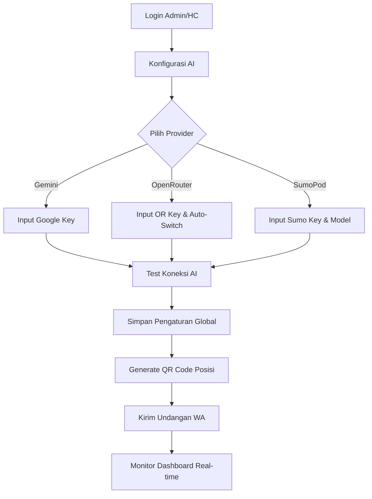
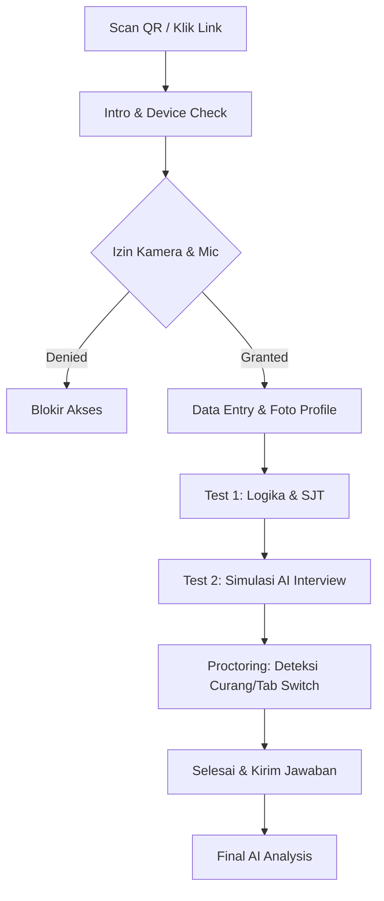
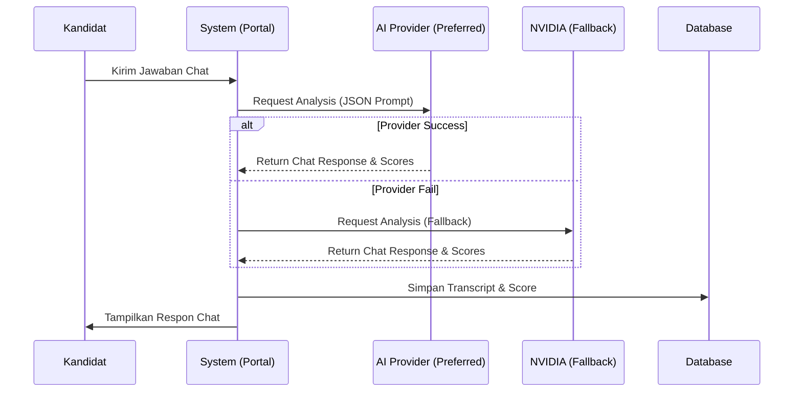

# Mobeng Portal 5 - System Workflow

Dokumen ini menjelaskan alur kerja sistem dari sisi Rekruter dan Kandidat, serta bagaimana AI memproses data.

## 1. Alur Kerja Rekruter (Setup & Monitoring)

## 2. Alur Kerja Kandidat (Testing Phase)

## 3. Alur Kerja Mesin AI (Processing Engine)

## 4. Metodologi Penilaian (Psychometric Framework)

Sistem ini menggunakan framework **Google Hiring Attributes** yang disesuaikan dengan kebutuhan industri otomotif Mobeng:

1.  **GCA (General Cognitive Ability)**: Diukur melalui skor Logika dan struktur jawaban.
2.  **RRK (Role-Related Knowledge)**: Diukur melalui simulasi kasus teknis bengkel/retail.
3.  **Culture Fit**: Penilaian nilai-nilai *Introspeksi, Innovasi, Komitmen, Kolaborasi*.
4.  **Big Five Personality (OCEAN)**: Analisis linguistik terhadap pola komunikasi kandidat.
5.  **STAR Method**: Evaluasi bagaimana kandidat menjelaskan tindakan dan hasil dari sebuah situasi.

---
*Dokumen ini dibuat otomatis oleh Antigravity AI untuk Mobeng Portal 5.*
